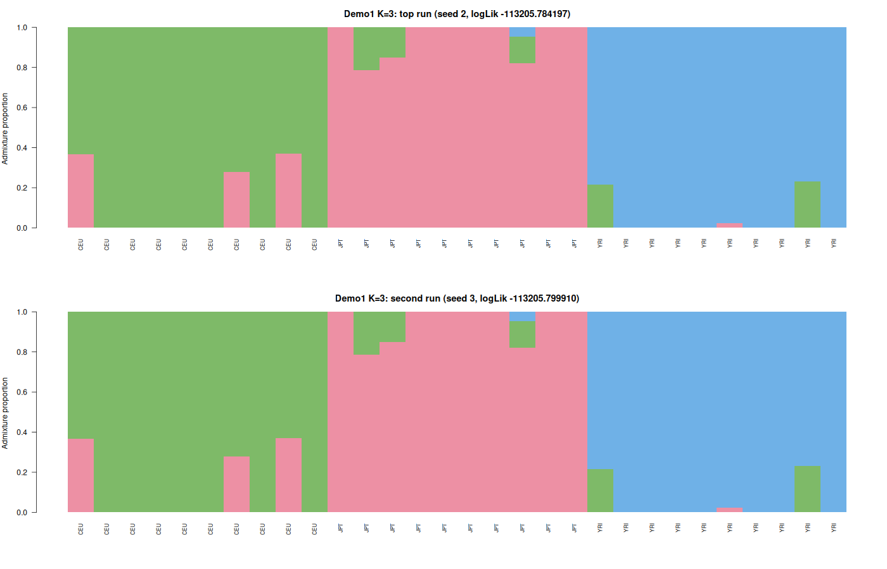
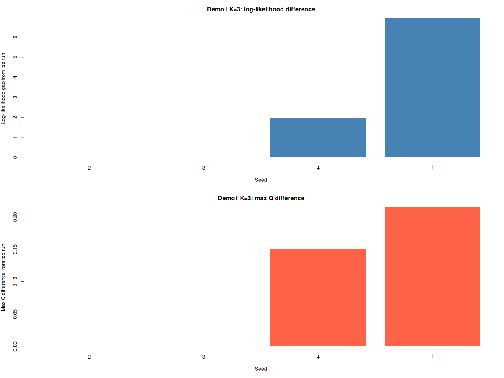
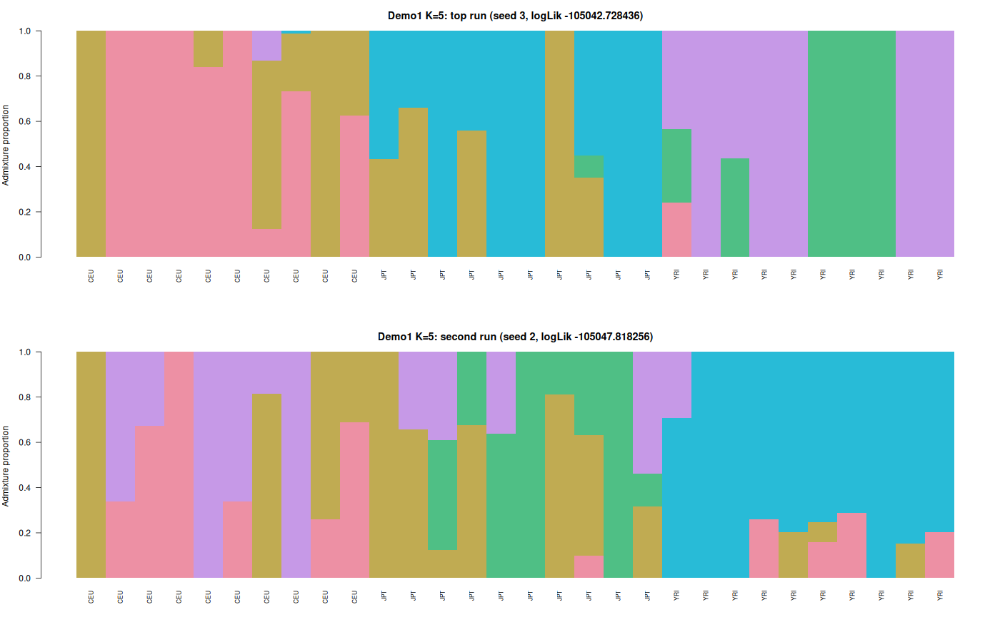
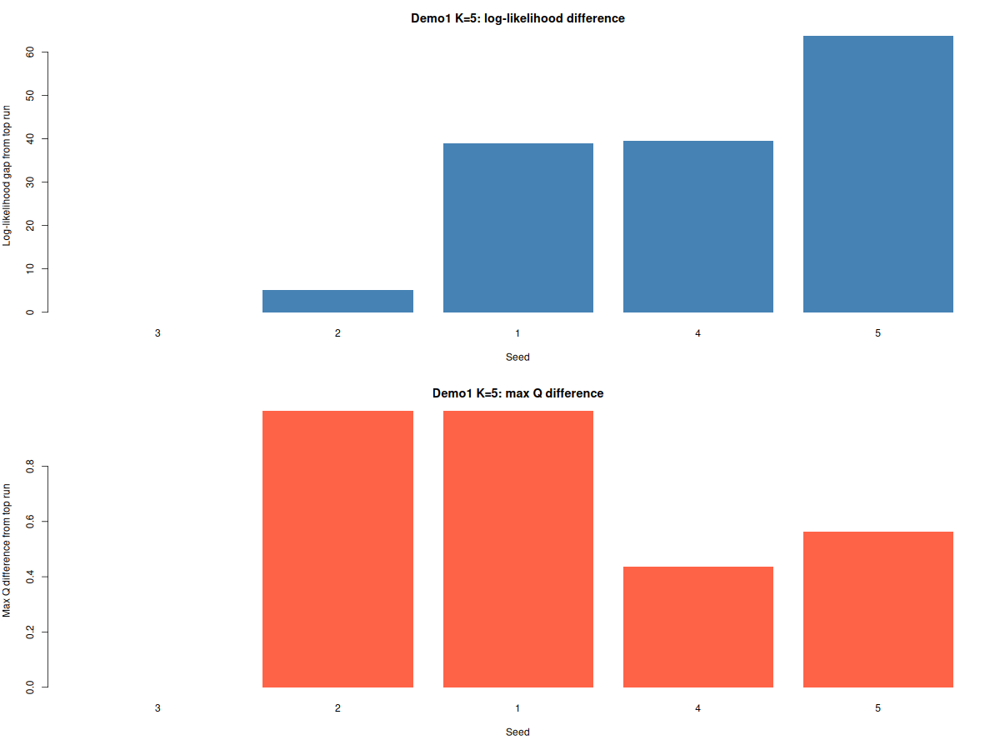

# NGSadmix Convergence Tutorial

This tutorial shows how to use:

- `scripts/convergenceNGSadmix.sh`
- `scripts/Qconv.R`

to check convergence across multiple random seeds.

The examples below use `Demo1input.gz` because it runs quickly. The goal is to show one short run that converges and one short run that does not.

## What The Workflow Produces

For each value of `K`, `scripts/convergenceNGSadmix.sh` writes:

- `*.likes.tmp`: seed and best log-likelihood for each run
- `*.likes`: the same file sorted by log-likelihood
- `*.run_status.tsv`: per-seed status, including both convergence counters
- `*.summary.txt`: final summary, including whether convergence was reached
- `*.qopt.<seed>` and `*.fopt.gz.<seed>`: saved outputs from each seed
- `*.qopt_conv`, `*.fopt_conv.gz`, `*.log_conv`: saved converged outputs if convergence is reached
- `*.qopt_best`, `*.fopt_best.gz`, `*.log_best`: saved best-likelihood outputs

`scripts/Qconv.R` compares all saved `Q` matrices to the top-likelihood run and reports:

- log-likelihood difference from the best run
- mean and maximum `Q` difference
- whether each run passes the chosen `Q`-difference threshold

## Example 1: Demo1 Converges Quickly For `K=3`

Run:

```bash
scripts/convergenceNGSadmix.sh Demo/Data/Demo1input.gz 5 4 Demo/Results/Demo1ConvK3 3 3 /home/albrecht/github/NGSadmix
```

Generate the `Q`-comparison table:

```bash
Rscript scripts/Qconv.R Demo/Results/Demo1ConvK3/Demo1input.gz.3.likes.tmp Demo/Results/Demo1ConvK3/3.Qlist 0.01 > Demo/Results/Demo1ConvK3/Demo1input.gz.3.qconv.tsv
```

Inspect the main outputs:

```bash
cat Demo/Results/Demo1ConvK3/Demo1input.gz.3.summary.txt
cat Demo/Results/Demo1ConvK3/Demo1input.gz.3.run_status.tsv
cat Demo/Results/Demo1ConvK3/Demo1input.gz.3.likes
cat Demo/Results/Demo1ConvK3/Demo1input.gz.3.qconv.tsv
```

What happens here:

- The run reaches convergence after seed 4.
- In this short example, convergence is triggered by the log-likelihood criterion.
- The best run is seed 2.
- The second-best run is seed 3.
- The log-likelihood gap between the top two runs is only `0.015713`.
- The maximum `Q` difference between the top two runs is only `0.00138146887015556`.

That is what a stable result looks like in a quick check: the top runs have nearly identical likelihoods and nearly identical admixture proportions.

### Top Two `K=3` Runs



### `K=3` Log-Likelihood And `Q` Differences



## Example 2: Demo1 Does Not Converge Quickly For `K=5`

Run:

```bash
scripts/convergenceNGSadmix.sh Demo/Data/Demo1input.gz 5 4 Demo/Results/Demo1ConvK5 5 3 /home/albrecht/github/NGSadmix
echo $?
```

The command exits with code `40`, which means no convergence was reached within the requested seeds.

Generate the `Q`-comparison table:

```bash
Rscript scripts/Qconv.R Demo/Results/Demo1ConvK5/Demo1input.gz.5.likes.tmp Demo/Results/Demo1ConvK5/5.Qlist 0.01 > Demo/Results/Demo1ConvK5/Demo1input.gz.5.qconv.tsv
```

Inspect the main outputs:

```bash
cat Demo/Results/Demo1ConvK5/Demo1input.gz.5.summary.txt
cat Demo/Results/Demo1ConvK5/Demo1input.gz.5.run_status.tsv
cat Demo/Results/Demo1ConvK5/Demo1input.gz.5.likes
cat Demo/Results/Demo1ConvK5/Demo1input.gz.5.qconv.tsv
```

What happens here:

- No convergence is reached within 5 seeds.
- Neither convergence counter gets above 1 in this short run.
- The best run is seed 3.
- The second-best run is seed 2.
- The log-likelihood gap between the top two runs is `5.08982`.
- The maximum `Q` difference between the top two runs is `0.999999995`.

That is exactly the kind of behavior you want to flag: the top run is better than the others, but the inferred admixture proportions are still very different across runs.

### Top Two `K=5` Runs



### `K=5` Log-Likelihood And `Q` Differences



## How To Read These Results

Use both criteria together:

- Small log-likelihood differences and small `Q` differences across the best runs suggest a stable solution.
- Large `Q` differences, even when log-likelihoods are close, suggest the inferred ancestry proportions are still unstable.
- If the script exits with code `40`, increase the number of seeds and try again.

For quick checks on small datasets, the Demo1 `K=3` and `K=5` examples above are useful reference points:

- `K=3` gives a short converged example.
- `K=5` gives a short non-converged example.
