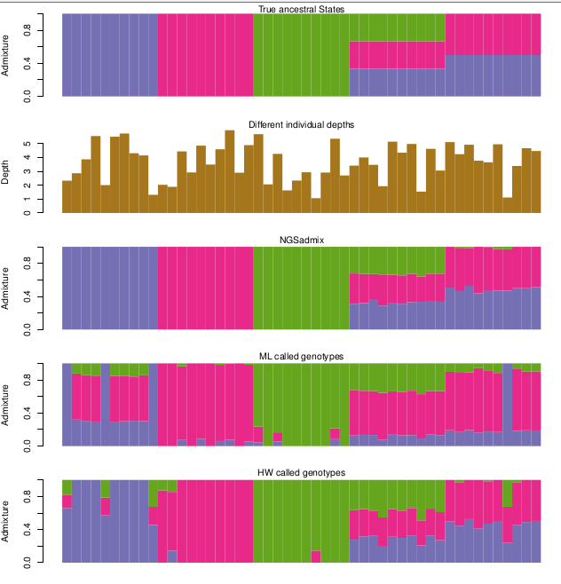

# NGSadmix

Inferring admixture proportions from NGS data.

<a href="docs/images/NgsAdmix.png">
  
</a>

NGSadmix estimates individual admixture proportions from next-generation sequencing data using genotype likelihoods rather than hard genotype calls. This makes it useful for medium- and low-coverage NGS data where genotype uncertainty matters.

NGSadmix is conceptually related to ADMIXTURE and STRUCTURE, but it works directly from genotype likelihoods. It is intended for population structure and recent admixture that still produces allele-frequency differences between individuals or groups.

Project website:
http://www.popgen.dk/software/index.php/NgsAdmix

# Tutorials

For a repository-local tutorial using the bundled demo input files, see [TUTORIAL.md](TUTORIAL.md).

For a tutorial on checking convergence across multiple NGSadmix runs, see [CONVERGENCE_TUTORIAL.md](CONVERGENCE_TUTORIAL.md).

# Installation

Clone and compile:

## Clone

```bash
git clone https://github.com/aalbrechtsen/NGSadmix.git
```

## Compile

```bash
cd NGSadmix
g++ NGSadmix.cpp -O3 -lpthread -lz -o NGSadmix
```

NGSadmix can also be installed as part of ANGSD. See the project website for that workflow.

# Quick Start

Run NGSadmix on a Beagle genotype-likelihood file:

```bash
./NGSadmix -likes inputBeagleFile.gz -K 3 -o outFileName -P 10
```

Main arguments:

- `-likes`: Beagle file with genotype likelihoods
- `-K`: number of ancestral populations
- `-o` or `-outfiles`: output prefix
- `-P`: number of threads

Example:

```bash
./NGSadmix -likes input.gz -K 3 -P 4 -o myoutfiles -minMaf 0.05
```

# Input Format

NGSadmix expects genotype likelihoods in Beagle format. The file may be gzip-compressed.

- Column 1: marker name
- Column 2: allele 1
- Column 3: allele 2
- Then 3 columns per individual with genotype likelihoods

# Output Files

NGSadmix writes these main output files:

- `.log`: run settings, progress, likelihoods, and timing
- `.qopt`: estimated admixture proportions for each individual
- `.fopt.gz`: estimated allele frequencies for each site and ancestral population
- `.filter`: per-site filtering summary

# Common Options

Useful options from the website and built-in help:

- `-seed`: seed for the random initialization
- `-fname`: starting ancestral population frequencies
- `-qname`: starting admixture proportions
- `-printInfo 1`: print marker ID and mean MAF for analyzed SNPs
- `-method 0`: disable EM acceleration
- `-misTol`: threshold for treating a site as missing, default `0.05`
- `-tolLike50`: stopping criterion based on likelihood change every 50 iterations, default `0.1`
- `-tol`: convergence tolerance, default `1e-5`
- `-dymBound`: use dynamic boundaries, default enabled
- `-maxiter`: maximum EM iterations, default `2000`
- `-minMaf`: minimum minor allele frequency, default `0.05`
- `-minLrt`: minimum likelihood-ratio threshold for MAF > 0
- `-minInd`: minimum number of informative individuals at a site

If you want to test stability across runs, use multiple seeds. This repository includes [CONVERGENCE_TUTORIAL.md](CONVERGENCE_TUTORIAL.md) for that workflow.

# Making A Beagle File

NGSadmix expects a Beagle-format genotype-likelihood file. Common ways to create one are from VCF files with genotype likelihoods or from BAM files using ANGSD.

## From VCF Files

If you already have a VCF file that contains genotype likelihood information, one option is to convert it to Beagle format with `vcftools`:

```bash
vcftools --vcf input.vcf --out test --BEAGLE-GL --chr 1,2
```

Chromosomes must be specified.

It is also possible to generate Beagle-style output from VCF data using `bcftools query`.

## From BAM Files Using ANGSD

The ANGSD documentation describes generating Beagle input with `-doGlf 2`, together with major/minor allele inference and genotype-likelihood estimation.

Example command from the ANGSD Beagle-input page:

```bash
./angsd -GL 1 -out genolike -nThreads 10 -doGlf 2 -doMajorMinor 1 -SNP_pval 1e-6 -doMaf 1 -bam bam.filelist
```

This produces:

```text
genolike.beagle.gz
```

The resulting Beagle file contains normalized genotype likelihoods for each individual at each site. The values often sum to 1 for each individual at a site, but they should still be interpreted as normalized likelihoods rather than posterior genotype probabilities.

ANGSD documentation:
https://www.popgen.dk/angsd/index.php/Beagle_input

# Citation

If you use NGSadmix, cite:

Skotte, L., Korneliussen, T. S., and Albrechtsen, A. (2013). Estimating individual admixture proportions from next generation sequencing data. Genetics 195(3): 693-702.
