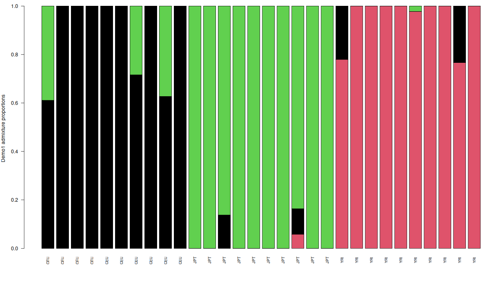
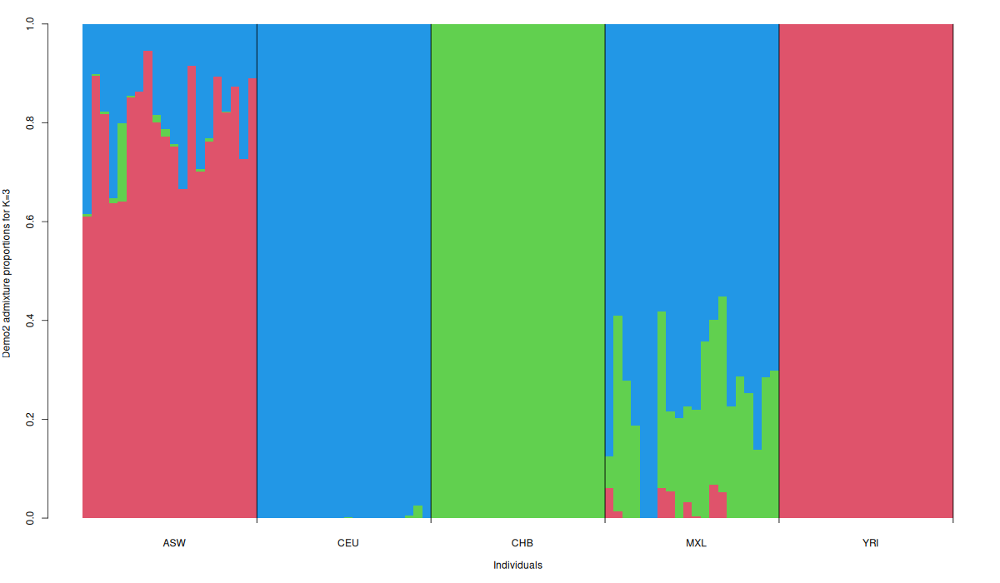
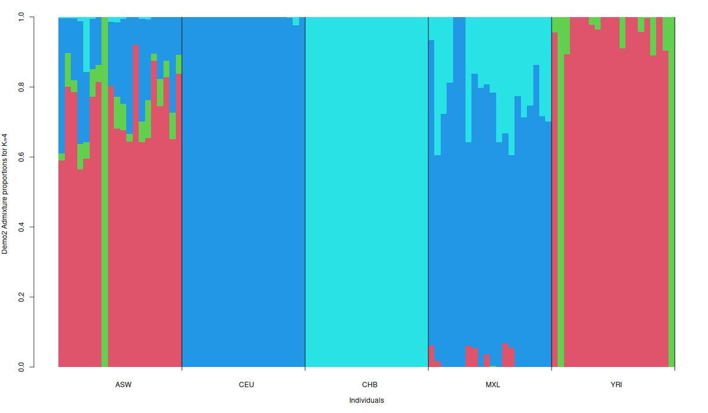

# NGSadmix Tutorial

## Repository Layout

- `./NGSadmix` is the compiled executable
- `./NGSadmix.cpp` is the source code
- `./Demo/Data/` contains the tutorial input files
- `./Demo/Results/` is the recommended output directory for tutorial runs

The tutorial data included in the repository:

- `Demo/Data/Demo1input.gz`
- `Demo/Data/Demo1pop.info`
- `Demo/Data/Demo2input.gz`
- `Demo/Data/Demo2pop.info`

Generated output files such as `.log`, `.filter`, `.qopt`, `.fopt.gz`, and plot images should normally stay out of git.

## Build

Compile the program with:

```bash
g++ NGSadmix.cpp -O3 -lpthread -lz -o NGSadmix
```

## Setup

Run all commands below from the repository root.

Create an output directory:

```bash
mkdir -p Demo/Results
```

Check that the expected input files are present:

```bash
ls Demo/Data
```

## Input Format

NGSadmix expects genotype likelihoods in Beagle format.

- Column 1: marker name
- Column 2: allele 1
- Column 3: allele 2
- Then 3 columns per individual:
  first homozygote likelihood for allele 1, then heterozygote, then homozygote for allele 2

The likelihoods for each individual at a site should sum to a positive value. In many Beagle files they are normalized to sum to 1, but they are still likelihoods, not posterior genotype probabilities.

Take a quick look at the first dataset:

```bash
gunzip -c Demo/Data/Demo1input.gz | head -n 10 | cut -f 1-10 | column -t
gunzip -c Demo/Data/Demo1input.gz | wc -l
```

Summarize the population labels with:

```bash
cut -f 1 -d " " Demo/Data/Demo1pop.info | sort | uniq -c
```

Create a label file for plotting Example 1:

```bash
cut -f 1 -d " " Demo/Data/Demo1pop.info > Demo/Results/poplabel
```

## Example 1: Small Three-Population Dataset

This dataset contains 30 individuals:

- 10 CEU
- 10 JPT
- 10 YRI

Run NGSadmix with `K=3`:

```bash
./NGSadmix \
  -likes Demo/Data/Demo1input.gz \
  -K 3 \
  -minMaf 0.05 \
  -seed 1 \
  -o Demo/Results/Demo1NGSadmix
```

This produces:

- `Demo1NGSadmix.log`: run settings and convergence summary
- `Demo1NGSadmix.filter`: site-level filtering summary
- `Demo1NGSadmix.qopt`: inferred admixture proportions per individual
- `Demo1NGSadmix.fopt.gz`: inferred allele frequencies per site and ancestral population

Inspect the outputs:

```bash
cat Demo/Results/Demo1NGSadmix.log
zcat Demo/Results/Demo1NGSadmix.fopt.gz | head -n 5
head -n 5 Demo/Results/Demo1NGSadmix.qopt
```

### Plot Example 1 in R

Interactive R:

```r
pop <- scan("Demo/Results/poplabel", what = "character")
q <- read.table("Demo/Results/Demo1NGSadmix.qopt")
ord <- order(pop)
par(mar = c(7, 4, 1, 1))
barplot(
  t(q)[, ord],
  col = c(2, 1, 3),
  names.arg = pop[ord],
  las = 2,
  ylab = "Demo1 admixture proportions",
  cex.names = 0.75
)
```

Non-interactive PNG output:

```bash
Rscript -e 'png("Demo/Results/Demo1NGSadmix.png", width=1200, height=700); pop<-scan("Demo/Results/poplabel", what="character", quiet=TRUE); q<-read.table("Demo/Results/Demo1NGSadmix.qopt"); ord<-order(pop); par(mar=c(7,4,1,1)); barplot(t(q)[,ord], col=c(2,1,3), names.arg=pop[ord], las=2, ylab="Demo1 admixture proportions", cex.names=0.75); dev.off()'
```



## Example 2: Larger Dataset

The second example uses 50,000 sites from 100 individuals from five populations:

- ASW
- CEU
- CHB
- MXL
- YRI

The Example 2 input files are:

- `Demo/Data/Demo2input.gz`
- `Demo/Data/Demo2pop.info`

Summarize the population labels with:

```bash
cut -f 1 -d " " Demo/Data/Demo2pop.info | sort | uniq -c
```

Run NGSadmix with `K=3`:

```bash
./NGSadmix \
  -likes Demo/Data/Demo2input.gz \
  -K 3 \
  -P 1 \
  -minMaf 0.05 \
  -seed 21 \
  -o Demo/Results/Demo2NGSadmixK3
```

Then compare with `K=4`:

```bash
./NGSadmix \
  -likes Demo/Data/Demo2input.gz \
  -K 4 \
  -P 1 \
  -minMaf 0.05 \
  -seed 21 \
  -o Demo/Results/Demo2NGSadmixK4
```

Inspect the run summaries:

```bash
tail -n 20 Demo/Results/Demo2NGSadmixK3.log
tail -n 20 Demo/Results/Demo2NGSadmixK4.log
```

### Plot Example 2 in R

For `K=3`:

```r
pop <- read.table("Demo/Data/Demo2pop.info", as.is = TRUE)
q <- read.table("Demo/Results/Demo2NGSadmixK3.qopt")
ord <- order(pop[, 1])
barplot(
  t(q)[, ord],
  col = 2:10,
  space = 0,
  border = NA,
  xlab = "Individuals",
  ylab = "Demo2 admixture proportions for K=3"
)
text(tapply(1:nrow(pop), pop[ord, 1], mean), -0.05, unique(pop[ord, 1]), xpd = TRUE)
abline(v = cumsum(sapply(unique(pop[ord, 1]), function(x) sum(pop[ord, 1] == x))), col = 1, lwd = 1.2)
```

For `K=4`, replace `Demo2NGSadmixK3.qopt` with `Demo2NGSadmixK4.qopt`.

Non-interactive PNG output:

```bash
Rscript -e 'png("Demo/Results/Demo2NGSadmixK3.png", width=1200, height=700); pop<-read.table("Demo/Data/Demo2pop.info", as.is=TRUE); q<-read.table("Demo/Results/Demo2NGSadmixK3.qopt"); ord<-order(pop[,1]); par(mar=c(5,4,2,1)); barplot(t(q)[,ord], col=2:10, space=0, border=NA, xlab="Individuals", ylab="Demo2 admixture proportions for K=3"); text(tapply(1:nrow(pop), pop[ord,1], mean), -0.05, unique(pop[ord,1]), xpd=TRUE); abline(v=cumsum(sapply(unique(pop[ord,1]), function(x) sum(pop[ord,1]==x))), col=1, lwd=1.2); dev.off()'

Rscript -e 'png("Demo/Results/Demo2NGSadmixK4.png", width=1200, height=700); pop<-read.table("Demo/Data/Demo2pop.info", as.is=TRUE); q<-read.table("Demo/Results/Demo2NGSadmixK4.qopt"); ord<-order(pop[,1]); par(mar=c(5,4,2,1)); barplot(t(q)[,ord], col=2:10, space=0, border=NA, xlab="Individuals", ylab="Demo2 admixture proportions for K=4"); text(tapply(1:nrow(pop), pop[ord,1], mean), -0.05, unique(pop[ord,1]), xpd=TRUE); abline(v=cumsum(sapply(unique(pop[ord,1]), function(x) sum(pop[ord,1]==x))), col=1, lwd=1.2); dev.off()'
```





## Practical Notes

- The output directory should usually not be committed to git.
- `-seed` controls the random initialization and makes runs reproducible.
- `-K` is the assumed number of ancestral populations.
- `-P` sets the number of CPU threads.
- `-minMaf 0.05` filters out low-frequency sites before inference.

To compare models more carefully, run several seeds for the same `K` and compare the best likelihoods in the `.log` files.
